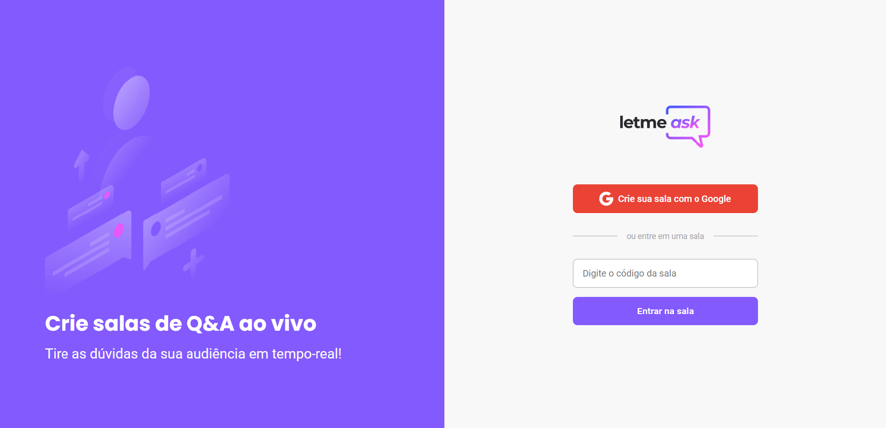

# Let Me Ask




> Let Me Ask foi aplicação feita seguindo o NLW together da RocketSeat. Este app permite criar salas para que os usuários possam fazer perguntas para um host, o host pode marcar a pergunta como lida e como respondendo e, por fim, os Usuários podem dar like nas perguntas. A aplicação foi feita utilizando a autenticação e o realtime database do Firebase. 

## Site em produção
  Quem sabe faz ao vivo meu!
  
  [Let Me Ask](https://letmeask-fe889.web.app/)

## 💻 Pré-requisitos

Antes de começar, verifique se você atendeu aos seguintes requisitos:
* Você possui o `Node Js` instalado em sua máquina?
* Você possui uma conta Google para utilizar no `Firebase`?

## 🚀 Instalando Let Me Ask

Para instalar o Let Me Ask, siga estas etapas:

* Abra o firebase, crie um projeto e adicione o Google como mecanismo de autenticação.
* Crie um realtime database.
* Pegue as configurações, crie um arquivo .env na pasta raiz do projeto e crie variáveis de acordo com os nomes das propriedades do objeto FirebaseConfig e insira os seus respectivos valores.
* Abra o terminal e navegue até a pasta do projeto e, depois:
```
npm install
```

## ☕ Usando Let Me Ask

Para usar Let Me Ask, siga estas etapas:

Na raiz do projeto, execute no terminal:
```
npm run start
```
Fique à vontade para contribuir!
